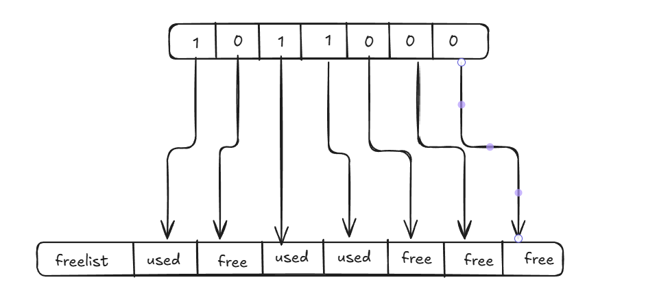
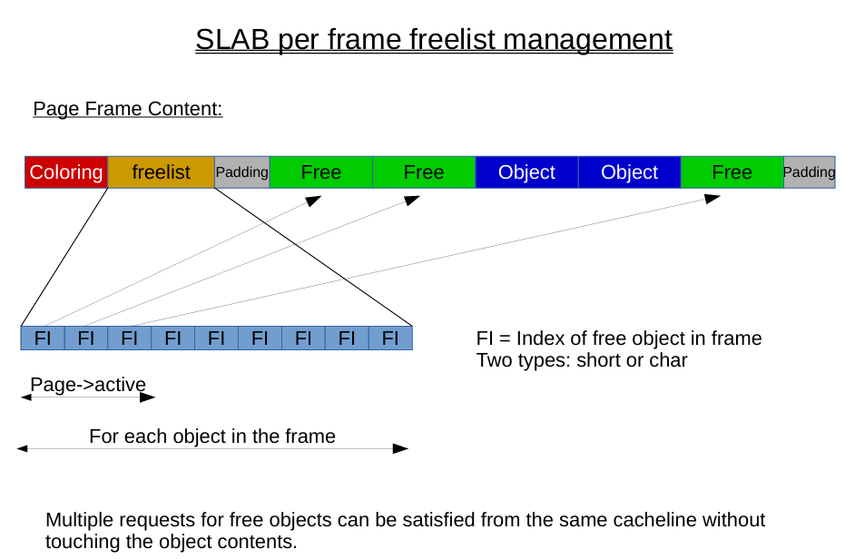
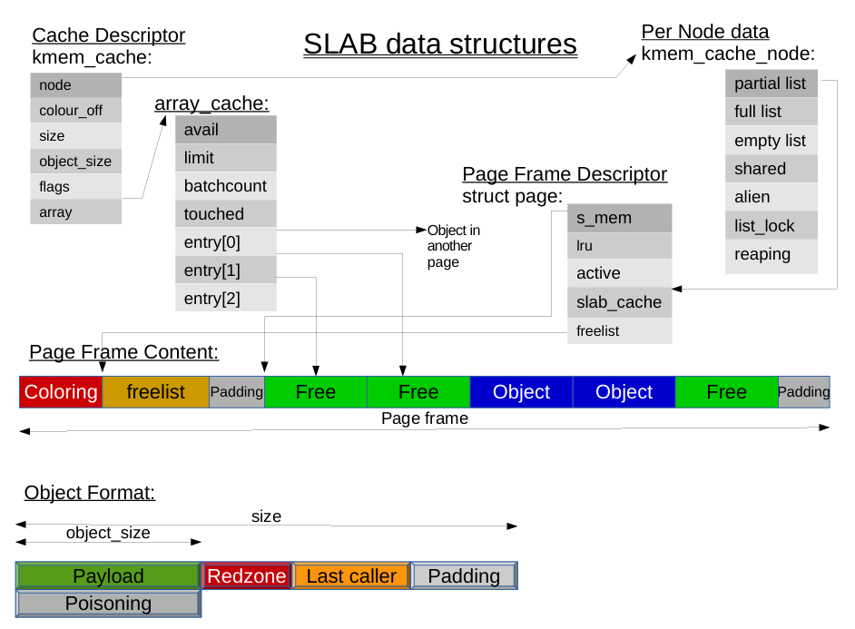
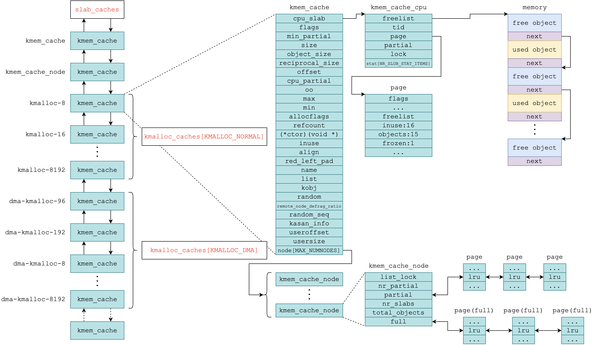
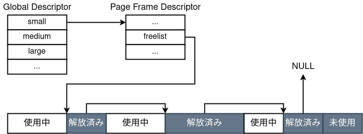

## Holstein v2: Heap Overflow

## Table of Contents

## Vulnerability module analysis

Unlike Holstein v1, Holstein v2 is vulnerable to heap overflow. The `buffer` now is a global variable `g_buf` allocated on the heap by `kmalloc()` in `module_open()`

```c
#define BUFFER_SIZE 0x400

char *g_buf = NULL;

static int module_open(struct inode *inode, struct file *file)
{
  printk(KERN_INFO "module_open called\n");

  g_buf = kmalloc(BUFFER_SIZE, GFP_KERNEL);
  if (!g_buf) {
    printk(KERN_INFO "kmalloc failed");
    return -ENOMEM;
  }

  return 0;
}
```

The `module_write()` function uses `copy_from_user()` to copy data from user space to the kernel space buffer `g_buf`. However, it does not check if the size of the data being copied exceeds the allocated buffer size, leading to a potential heap overflow vulnerability. The same as `module_read()`

```c
static ssize_t module_read(struct file *file,
                           char __user *buf, size_t count,
                           loff_t *f_pos)
{
  printk(KERN_INFO "module_read called\n");

  // Vulnerability: No bounds checking on count
  if (copy_to_user(buf, g_buf, count)) {
    printk(KERN_INFO "copy_to_user failed\n");
    return -EINVAL;
  }

  return count;
}

static ssize_t module_write(struct file *file,
                            const char __user *buf, size_t count,
                            loff_t *f_pos)
{
  printk(KERN_INFO "module_write called\n");

  // Vulnerability: No bounds checking on count
  if (copy_from_user(g_buf, buf, count)) {
    printk(KERN_INFO "copy_from_user failed\n");
    return -EINVAL;
  }

  return count;
}
```

And look at the `run.sh` script, the kernel is booted with `KPTI`, `KASLR` enabled, and `SMEP`/`SMAP` enabled.

```bash
#!/bin/sh
qemu-system-x86_64 \
    -m 64M \
    -nographic \
    -kernel bzImage \
    -append "console=ttyS0 loglevel=3 oops=panic panic=-1 pti=on kaslr" \
    -no-reboot \
    -cpu qemu64,+smap,+smep \
    -smp 1 \
    -monitor /dev/null \
    -initrd rootfs.cpio \
    -net nic,model=virtio \
    -net user \
```

## Kernel heap memory allocation mechanism

Similar to the `malloc()` function in userspace, the kernel provides the function `kmalloc()` to allocate memory on the heap. `kmalloc()` uses the splitter in the kernel, which is mainly SLAB, SLUB, and SLOB. The default allocator in modern Linux kernels is SLUB. These three allocators are not completely independent but have a common part of implementation, collectively known as the Slab allocator. Here is a brief introduction to the three allocators:

- `SLAB` is the oldest type of allocator of the above three, first introduced by Jeff Bonwick in the Solaris system, and its code implementation in Linux is located in [mm/slab.c](https://elixir.bootlin.com/linux/v5.15/source/mm/slab.c).

- `SLUB` means the unqueued slab allocator, designed by Christoph Lameter for large systems, it is characterized by being `as fast as possible`, and the code implementation in Linux is located at [mm/slub.c](https://elixir.bootlin.com/linux/v5.15/source/mm/slub.c). Since version 2.6.23, the Linux kernel has replaced SLAB with SLUB as the default memory allocator. Therefore, we will focus on attack methods against SLUB allocators.

- `SLOB` stands for simple list of blocks, mainly used in embedded systems, characterized by being `as lightweight as possible`, and the code implementation in Linux is located at [mm/slob.c](https://elixir.bootlin.com/linux/v5.15/source/mm/slob.c).

### SLAB Allocator

Have the following characteristics:

- Use different page frames depending on the amount of memory you need. Unlike libc malloc, SLAB allocates memory from different regions based on the size of the memory requirement. Therefore, there is no (requirement) length information before or after the allocated memory block.

- Use caching. For the allocation of small memory, the corresponding cache is used first. If the required memory is large, or if the cache is empty, the normal allocation mechanism is used.

- Use bitmaps to manage freed zones. An array of bits is maintained at the top of the memory page to indicate whether the page has freed the region of a particular index. Unlike libc malloc, it is not based on linked lists.

SLAB's memory management:







In reality, there are several entries in the cache, and the pointers to the freed areas listed there are priority used.
In addition, the following functions are provided by the `__kmem_cache_create` flag when generating a cache.

- `SLAB_POISON`: Freed areas are filled with 0xA5.
- `SLAB_RED_ZONE`: An area called redzone is added after the object, and is detected when it is rewritten using Heap Overflow or similar.

### SLUB Allocator

Have the following three features:

- Similar to SLAB, SLUB uses different page frames (kmalloc-64, kmalloc-128, kmalloc-256, etc.) depending on the required memory size. The difference is that SLUB-managed page boxes have no metadata at the beginning (such as free zone indexes). The page frame descriptor has a pointer to the beginning of the idle linked list.

- Similar to libc's tcache and fastbin, SLUB uses a one-way linked list to manage free zones.

- Similar to SLAB, each CPU has a cache, but SLUB also maintains them with one-way linked lists.

The data structure and relationship of SLUB memory management are shown in the figure below (take from [here](https://blog.wohin.me/posts/pawnyable-0202/)):



Details of each structure will show in [this article](https://evilpan.com/2020/03/21/linux-slab/#%E6%95%B0%E6%8D%AE%E7%BB%93%E6%9E%84).

In SLUB, you can enable debugging functions by adding characters to the `slub_debug` parameter when starting the kernel.

- F: Enable sanity check.
- P: Fills the freed area with a specific string of bits.
- U: Records stack traces of reserve and release.
- T: Takes usage logs for a specific slab cache.
- Z: Adds a redzone after the object to detect Heap Overflow

### SLOB Allocator

Have the following characteristics:

- K&R Allocator: This is a method of cutting out available areas from the beginning, such as glibc malloc, regardless of size. If you run out of space, you'll secure a new page. This makes it very prone to fragmentation.

- Management of freed areas with offset: glibc manages free areas by size in a list, such as tcache and fastbin. On the other hand, in SLOB, all the free areas are connected in order, regardless of size. Also, rather than having a pointer, a list has the size of its chunk and the offset information to the next release area. This information is written to the beginning of the freed area. When you secure it, follow this list and use it when you find a size that is available

- Freelist according to size: To reduce fragmentation, there are several lists that connect free objects by size.

The freed areas are managed in a one-way list by size and offset as follows: (The arrows that emerge from the freed area are offset information, not pointers.)



## Heap overflow exploitation ideas

Because the kernel heap is shared across drivers and cores, a vulnerability in one driver can overflow into and corrupt other kernel objects; attackers therefore use [heap spraying](https://en.wikipedia.org/wiki/Heap_spraying)—allocating many controlled objects filled with attacker data—to place desirable targets next to vulnerable objects and greatly increase the success rate and stability of heap-overflow exploits. Heap Spray can be used for 2 purposes:

1. Use up freelists that already exist
    > If objects are reserved from freelist, there is no guarantee that the objects you want to destroy will be next to each other. Therefore, you must pre-consum the freelist for the target size band.

2. Side objects side by side
    > There is a high possibility that objects will be next to each other when you consume freelist, but depending on the allocator, you don't know whether to consume the page from the front or the back, so just fill in the front and back of the object with the Heap Overflow with the object you want to destroy.

## Abuse the heap overflow vulnerability in Holstein v2

Look back the ways to allocate and free `g_buf` in Holstein v2:

```c
#define BUFFER_SIZE 0x400
char *g_buf = NULL;
g_buf = kmalloc(BUFFER_SIZE, GFP_KERNEL);
```

The size `0x400` corresponds to `kmalloc-1024` in SLUB. You can find the slab system information at `/proc/slabinfo`. Therefore, the destructible objects are basically sized at `0x400`. It is the eligible kernel object `tty_struct` (usually around 0x2c0 in size), which is defined in [include/linux/tty.h](https://elixir.bootlin.com/linux/v5.15/source/include/linux/tty.h#L122):

```c
struct tty_struct {
	int	magic;
	struct kref kref;
	struct device *dev;	/* class device or NULL (e.g. ptys, serdev) */
	struct tty_driver *driver;
	const struct tty_operations *ops;
    // ...
} __randomize_layout;
```

the file `/dev/ptmx` is a character device file that provides a pseudo-terminal (PTY) interface which is initialized in [drivers/tty/pty.c](https://elixir.bootlin.com/linux/v5.15/source/drivers/tty/pty.c#L883):

```c
static void __init unix98_pty_init(void)
{
    [...]
    /* Now create the /dev/ptmx special device */
	tty_default_fops(&ptmx_fops);
	ptmx_fops.open = ptmx_open;

	cdev_init(&ptmx_cdev, &ptmx_fops);
	if (cdev_add(&ptmx_cdev, MKDEV(TTYAUX_MAJOR, 2), 1) ||
	    register_chrdev_region(MKDEV(TTYAUX_MAJOR, 2), 1, "/dev/ptmx") < 0)
		panic("Couldn't register /dev/ptmx driver");
	device_create(tty_class, NULL, MKDEV(TTYAUX_MAJOR, 2), NULL, "ptmx");
}
```

and when we open `/dev/ptmx`, the `ptmx_open()` function will be called, which is defined in [drivers/tty/pty.c](https://elixir.bootlin.com/linux/v5.15/source/drivers/tty/pty.c#L800):

```c
static int ptmx_open(struct inode *inode, struct file *filp)
{
	struct pts_fs_info *fsi;
	struct tty_struct *tty;
	struct dentry *dentry;
	int retval;
	int index;

	nonseekable_open(inode, filp);

	/* We refuse fsnotify events on ptmx, since it's a shared resource */
	filp->f_mode |= FMODE_NONOTIFY;

	retval = tty_alloc_file(filp);
	if (retval)
		return retval;

	fsi = devpts_acquire(filp);
	if (IS_ERR(fsi)) {
		retval = PTR_ERR(fsi);
		goto out_free_file;
	}

	/* find a device that is not in use. */
	mutex_lock(&devpts_mutex);
	index = devpts_new_index(fsi);
	mutex_unlock(&devpts_mutex);

	retval = index;
	if (index < 0)
		goto out_put_fsi;


	mutex_lock(&tty_mutex);
	tty = tty_init_dev(ptm_driver, index);
	/* The tty returned here is locked so we can safely
	   drop the mutex */
	mutex_unlock(&tty_mutex);

	retval = PTR_ERR(tty);
	if (IS_ERR(tty))
		goto out;

	/*
	 * From here on out, the tty is "live", and the index and
	 * fsi will be killed/put by the tty_release()
	 */
	set_bit(TTY_PTY_LOCK, &tty->flags); /* LOCK THE SLAVE */
	tty->driver_data = fsi;

	tty_add_file(tty, filp);
    [...]
}
```


```c
int tty_alloc_file(struct file *file)
{
	struct tty_file_private *priv;

	priv = kmalloc(sizeof(*priv), GFP_KERNEL);
	if (!priv)
		return -ENOMEM;

	file->private_data = priv;

	return 0;
}

struct tty_struct *tty_init_dev(struct tty_driver *driver, int idx)
{
	struct tty_struct *tty;
	int retval;

	/*
	 * First time open is complex, especially for PTY devices.
	 * This code guarantees that either everything succeeds and the
	 * TTY is ready for operation, or else the table slots are vacated
	 * and the allocated memory released.  (Except that the termios
	 * may be retained.)
	 */

	if (!try_module_get(driver->owner))
		return ERR_PTR(-ENODEV);

	tty = alloc_tty_struct(driver, idx);
    [...]
}

struct tty_struct *alloc_tty_struct(struct tty_driver *driver, int idx)
{
	struct tty_struct *tty;

	tty = kzalloc(sizeof(*tty), GFP_KERNEL);

    [...]
}
```

The `tty_alloc_file()` function allocates a `tty_file_private` structure, and the `alloc_tty_struct()` function allocates a `tty_struct` structure. Both structures are allocated using `kmalloc()`, and the size of `tty_struct` is `0x2e0`, and `kmalloc-1024` wwill be called. So if we call `ioctl();` on the file descriptor of `/dev/ptmx`, the function `tty_ioctl()` will be called, which is defined in [drivers/tty/tty_io.c](https://elixir.bootlin.com/linux/v5.15/source/drivers/tty/tty_io.c#L2681):

```c
long tty_ioctl(struct file *file, unsigned int cmd, unsigned long arg)
{
	struct tty_struct *tty = file_tty(file);
	struct tty_struct *real_tty;
	void __user *p = (void __user *)arg;
	int retval;
	struct tty_ldisc *ld;

	if (tty_paranoia_check(tty, file_inode(file), "tty_ioctl"))
		return -EINVAL;
    [...]
}

static int tty_paranoia_check(struct tty_struct *tty, struct inode *inode,
			      const char *routine)
{
#ifdef TTY_PARANOIA_CHECK
	if (!tty) {
		pr_warn("(%d:%d): %s: NULL tty\n",
			imajor(inode), iminor(inode), routine);
		return 1;
	}
	if (tty->magic != TTY_MAGIC) {
		pr_warn("(%d:%d): %s: bad magic number\n",
			imajor(inode), iminor(inode), routine);
		return 1;
	}
#endif
	return 0;
}
```

The `tty_paranoia_check()` function checks the `magic` field of the `tty_struct` structure. The `magic` field is used to verify that the structure is valid and has not been corrupted. If the `magic` field does not match the expected value, the function returns an error. And this `magic` has the value `0x5401`. After the check, the `tty_ioctl()` function will continue to execute, it go into switch-case statement to handle different [ioctl commands](https://elixir.bootlin.com/linux/v5.15/source/drivers/tty/tty_io.c#L2697-L2803). If there is no maching case, it will go to the default case:

```c
	default:
		retval = tty_jobctrl_ioctl(tty, real_tty, file, cmd, arg);
		if (retval != -ENOIOCTLCMD)
			return retval;
	}
	if (tty->ops->ioctl) {
		retval = tty->ops->ioctl(tty, cmd, arg);
		if (retval != -ENOIOCTLCMD)
			return retval;
	}
```

just focus on the `if (tty->ops->ioctl)` statement, the `ops` field of the `tty_struct` structure is a pointer to a `tty_operations` structure, which contains function pointers for various operations that can be performed on the TTY device. One of these function pointers is `ioctl`, which points to a function that handles ioctl commands specific to the TTY device. If this function pointer is not NULL, the `tty_ioctl()` function calls it, passing in the `tty_struct` structure, the command, and the argument. The specific implementation of this function will depend on the type of TTY device being used. So if we can overwrite the `ops` field of the `tty_struct` structure to point to a fake `tty_operations` structure that we control, we can make the `ioctl` function pointer point to a function of our choice, and achieve arbitrary code execution in kernel mode.

**The ioctl (input/output control) system call in Linux is used to manipulate the underlying device parameters of special files. It is a powerful and flexible interface that allows user-space applications to interact with device drivers at a low level. The ioctl system call can control various operating characteristics of character special files, such as terminals, and is often used for operations that do not fit the standard stream I/O model.**

## So what's the attack plan?

We use heap spray because unlike the userspace heap, the kernel heap has no granularity that that chunk are allocate next to our overflow chunk. So even if we can overflow the `g_buf` buffer, we cannot guarantee that the `tty_struct` structure will be allocated next to it. So we need to use heap spray to allocate many `tty_struct` structures, and hope that one of them will be allocated next to the `g_buf` buffer.

<updating...>
