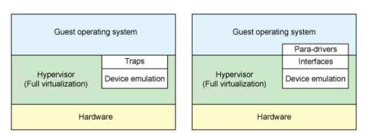
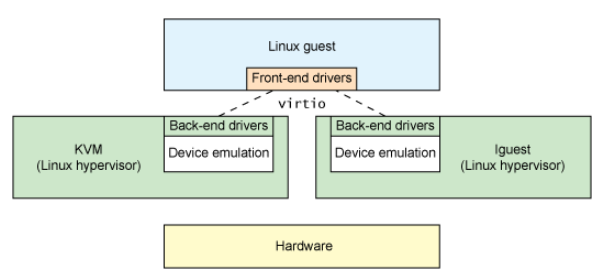
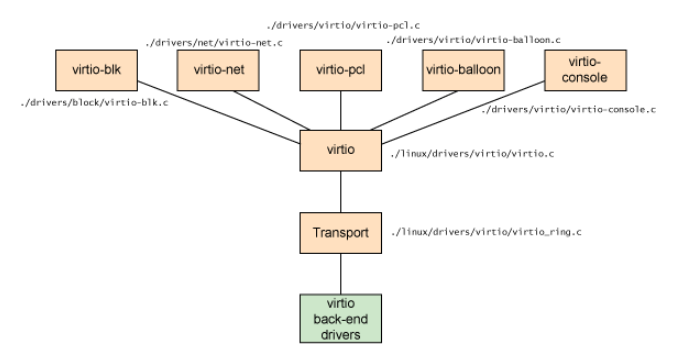

> **Virtio** is a standard way for virtual machines to talk to virtual devices. It acts as a middle layer (an abstraction) between the guest and the hypervisor.
>
>In Linux, many hypervisors exist (like **KVM**, **lguest**, and **User-mode Linux**). Each could handle virtual devices differently, which causes complexity. **Virtio** solves this by providing a **common framework** so all these hypervisors can use the same device interface for things like network or disk access — making the system faster, simpler, and more consistent.

### Full virtualization vs. paravirtualization

**Full Virtualization:**
- The guest OS runs on top of a hypervisor.
    
- It doesn’t know it’s being virtualized — no changes are needed.
    
- The hypervisor emulates all hardware (like CPU, disk, or network).
    
- This gives high compatibility but is slower because emulation is heavy.
    
- Examples: VMware, VirtualBox, KVM (using emulation mode).

**Paravirtualization:**
- The guest OS knows it’s running inside a virtual machine.

- It includes special code (para-drivers) to talk directly with the hypervisor.

- This reduces emulation and makes performance faster.

- But it needs a modified OS that supports these para-drivers.

- Examples: Xen (with para mode), Hyper-V, virtio drivers in KVM.

**Device emulation in full virtualization and paravirtualization environments**

>Hardware continues to change with virtualization. New processors incorporate advanced instructions to make guest operating systems and hypervisor transitions more efficient. And hardware continues to change for input/output (I/O) virtualization, as well (see resources on the right to learn about Peripheral Controller Interconnect [PCI] passthrough and single- and multi-root I/O virtualization).

In **full virtualization**, the guest OS doesn’t know it’s virtualized. The hypervisor traps and emulates hardware, which makes it slower but allows any OS to run.

In **paravirtualization**, the guest OS knows it’s virtualized and uses para-drivers to talk directly with the hypervisor. This is faster but needs a modified OS.

**Virtio** provides a standard way for these para-drivers to work. It connects the **front end** (driver runs on the guest) with the **back end** (device runs on the host), improving communication speed and reducing emulation overhead. Similar systems include **Xen** with paravirtualized drivers and **VMware Guest Tools**, which provide the same function.

### Virtio abstraction for Linux guests

Virtio provides a common interface for emulated devices in a paravirtualized hypervisor. It lets the hypervisor expose standard virtual devices that the guest can use through front-end drivers.

The **front end** (runs in the guest) talks to the **back end** (runs in the hypervisor on the host) using the virtio interface. This setup makes device communication faster and easier to reuse across different hypervisors.

In practice, the back-end drivers often run in **QEMU user space**, handling I/O between the guest and the host hardware (like PCI host controller, disk, network, video hardware, USB controller, and other hardware elements).

### Virtio architecture

Virtio connects the drivers inside the guest with the devices managed by the hypervisor. It uses virtual queues to pass data and commands back and forth between them.

Each type of virtual device, like network, disk, console, or balloon, has its own virtio driver. For example, the virtio network driver uses two queues — one for sending and one for receiving data — while the block driver only needs one. These queues act like shared buffers that make communication between the guest and the hypervisor fast and efficient.

> As shown above, five front-end drivers are listed for block devices (such as disks), network devices, PCI emulation, a balloon driver (for dynamically managing guest memory usage), and a console driver. Each front-end driver has a corresponding back-end driver in the hypervisor.

Overall, virtio provides a common and flexible way for different virtual devices to communicate smoothly between the guest OS and the host system.
