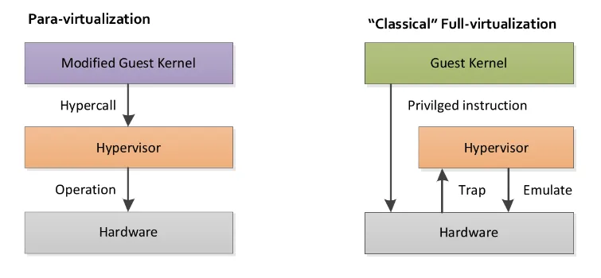
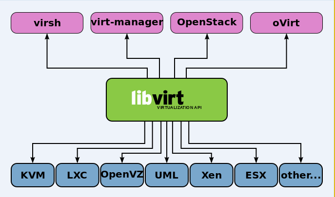
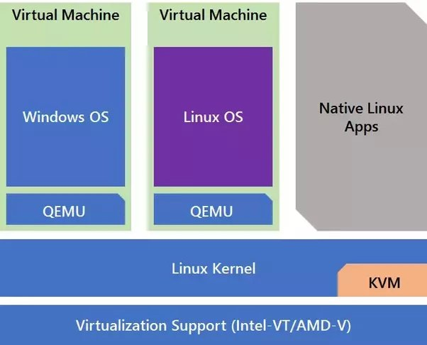

## What is QEMU?

QEMU (Quick EMUlator) is a free and open-source emulator and virtualizer that enables users to run operating systems and applications for one machine on a different machine. It achieves this by emulating the hardware of the target system, allowing software designed for one architecture to run on another.

A guest operating system runs inside a virtual machine (VM) created by QEMU, while the host operating system is the one running on the physical hardware. QEMU can operate in two primary modes:

- Full System Emulation: In this mode, QEMU emulates an entire hardware platform, including the CPU, memory, and peripherals. This allows users to run operating systems designed for different architectures (e.g., running ARM OS on an x86 machine).

- User-mode Emulation: In this mode, QEMU can run individual applications compiled for one architecture on another architecture by translating system calls and CPU instructions.

QEMU also supports hypervisor capabilities when used in conjunction with KVM (Kernel-based Virtual Machine) on Linux, allowing for near-native performance by leveraging hardware virtualization features. In this setup, QEMU acts as a Virtual Machine Monitor (VMM) or as a device emulation back-end for virtual machines running under a hypervisor, managing the virtual machines while KVM handles the low-level virtualization tasks.

## KVM and QEMU

KVM - QEMU is a virtualization that combines QEMU with KVM (Kernel-based Virtual Machine) to provide efficient and high-performance virtualization on Linux systems. KVM is a kernel module that allows the Linux kernel to function as a hypervisor, enabling the creation and management of virtual machines (VMs).

When QEMU is used with KVM, it leverages hardware virtualization features provided by modern CPUs (such as Intel VT-x and AMD-V) to run guest operating systems with near-native performance. In this setup, KVM handles the low-level virtualization tasks, while QEMU provides device emulation and manages the virtual machines.

We also need to note there are 2 concepts here:

- Paravirtualization: A virtualization technique where the guest operating system is aware of the virtualization environment and can interact with the hypervisor for improved performance. In paravirtualization, the guest OS is modified to work efficiently with the hypervisor, allowing for better communication and resource management.

- Full Virtualization: A virtualization technique where the guest operating system is not aware of the virtualization environment and runs unmodified. In full virtualization, the hypervisor emulates the underlying hardware, allowing the guest OS to run as if it were on a physical machine.

## [Management Tools](https://www.linux-kvm.org/page/Management_Tools)

For each type of virtualization like KVM, Xen, there will be a Libvirt process running to provide a common API for some tools like Virt-Manager, Virsh, OpenStack, etc. to communicate with the KVM - QEMU.

Libvirt is a management library that exposes APIs (usable from Python and other languages) for creating and configuring virtual machines. Virsh is a command-line tool that talks to Libvirt to manage and inspect VMs. Virt‑Manager is a desktop GUI (similar to VMware Player) that uses Libvirt as its backend.

## Relationship between QEMU and KVM

From the anwser of [Kaustubh Pradhan](https://www.quora.com/How-do-KVM-and-QEMU-work-together) for the question "How do KVM and QEMU work together?":
> KVM - resides in the Linux kernel as a loadable module. Once loaded, KVM converts the Linux kernel into a type-1 hypervisor aka bare-metal hypervisor. KVM virtualization uses the Linux kernel as its hypervisor (VM is essentially a process). However, it depends on the Intel-VT and AMD-V virtualization extensions on Intel and AMD respectively for hardware assists to enable robust virtualization. Working in concert with these extensions, KVM helps deliver a better virtualization experience with higher throughput of almost near-zero latency. Thus all the VMs (read process) can run without any performance or compatibility hit, as if it was running natively on a dedicated CPU. Also, because of the the aforementioned extensions the VMs have a greater awareness of the capabilities of the underlying hardware platform. Therefore, is fair to say that KVM offers hardware virtualization in its sincerest and best form.
>
> QEMU - On the other hand resides in the user space and provides system emulation including the processor and various peripherals. Typically, QEMU is deployed along with KVM as an in-kernel accelerator where KVM executes most of the guest code natively, while QEMU emulates the rest of the machine (peripherals) needed by the guest. In places where the VM has to talk to external devices, QEMU uses passthrough.
>
> 

So summarizing the relationship between QEMU and KVM:
- KVM is a kernel module that provides hardware-assisted virtualization capabilities to the Linux kernel, turning
it into a type-1 hypervisor.
- QEMU is a user-space application that provides system emulation, including CPU and peripheral emulation.
- When used together, KVM handles the low-level virtualization tasks, while QEMU manages the virtual machines and provides device emulation.
- This combination allows for efficient and high-performance virtualization on Linux systems, enabling users to run multiple virtual machines with near-native performance.

The combination of KVM and QEMU is widely used in various virtualization solutions, including cloud computing platforms, data centers, and development environments, due to its flexibility, performance, and open-source nature.

## References

- [QEMU](https://hackmd.io/@Broder/qemu#Qemu)
- [QEMU - Wikipedia](https://en.wikipedia.org/wiki/QEMU)
- [How do KVM and QEMU work together? - Quora](https://www.quora.com/How-do-KVM-and-QEMU-work-together)
- [Understanding Hypervisors: Exploring Type-1 vs Type-2 and Full vs Para Virtualization](https://medium.com/@ravipatel.it/understanding-hypervisors-exploring-type-1-vs-type-2-and-full-vs-para-virtualization-71b4dad9abd9)
