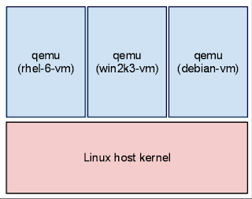
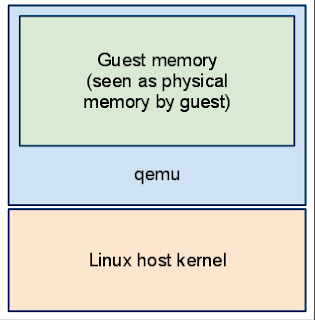
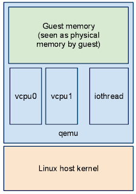

## Big picture overview

### Guest processes

A guest is created by running QEMU program, aka `qemu-kvm` or just `qemu`. The picture below shows that on the host machine, we have 3 QEMU processes running, each hosting a guest OS. Each QEMU process is responsible for emulating the hardware for its guest OS



When a guest shuts down the qemu process exits. Reboot can be performed without restarting the qemu process for convenience although it would be fine to shut down and then start qemu again.

### Guest RAM

When a guest is started, QEMU allocates a chunk of memory on the host machine to be used as the guest RAM. This memory is allocated from the host OS like any other program would allocate memory. The guest OS and its applications then use this memory as if it were their own RAM. It is possible to pass in file-backed memory with `-mem-path` such as `hugetlbfs` to back the guest RAM. Either way, the RAM is mapped in the QEMU process's address space and act like the "physical" RAM for the guest



QEMU supports both big-endian and little-endian for the guest architecture so guest memory accesses may require byte-swapping depending on the host architecture. Endian conversion is performed by helper functions instead of accessing the memory (guest RAM) directly. This make it possible to support different endianness for guest and host.

### KVM virtualization

KVM is a Linux kernel module that provides hardware-assisted virtualization capabilities. When KVM is used, QEMU can offload some of the CPU emulation work to the host CPU, which significantly improves performance. With KVM, the guest code can run directly on the host CPU in a special mode called "guest mode", while QEMU handles the emulation of other hardware components.

In order to execute the guest code using KVM, QEMU interacts with the KVM kernel module through the `/dev/kvm` device file. QEMU uses various `ioctl` calls to set up the virtual machine, configure its memory and CPU state, and manage its execution. When the guest access the hardware device registers, halts the guest CPU, or triggers a VM exit, or some special instructions, KVM exits back to QEMU. At this point, QEMU can emulate the desired behavior and then resume the guest execution or just wait for the next guest interrupt in the case of a halted CPU.

You can find the interaction between QEMU and KVM in the QEMU source code [./kvm-all.c](https://elixir.bootlin.com/qemu/v0.12.0-rc1/source/kvm-all.c). Here is what happens when a guest is started with KVM enabled:

1. QEMU opens the `/dev/kvm` device file to communicate with the KVM kernel module.

```c
    s->fd = qemu_open("/dev/kvm", O_RDWR); // Open KVM device
    if (s->fd == -1) {
        fprintf(stderr, "Could not access KVM kernel module: %m\n");
        ret = -errno;
        goto err;
    }
```

2. Create a new virtual machine (VM) by calling the `KVM_CREATE_VM` ioctl.

```c
    s->vmfd = kvm_ioctl(s, KVM_CREATE_VM, 0); // Create a new VM
    if (s->vmfd < 0)
        goto err;
```

3. Map memory for virtual machine and initiate PCI and signals

```c
static int kvm_set_user_memory_region(KVMState *s, KVMSlot *slot)
{
    struct kvm_userspace_memory_region mem;

    mem.slot = slot->slot; // Memory slot number
    mem.guest_phys_addr = slot->start_addr; // Guest physical address
    mem.memory_size = slot->memory_size; // Size of the memory region
    mem.userspace_addr = (unsigned long)qemu_get_ram_ptr(slot->phys_offset); // Host virtual address
    mem.flags = slot->flags; // Memory region flags
    if (s->migration_log) {
        mem.flags |= KVM_MEM_LOG_DIRTY_PAGES; // Enable dirty page logging if migration log is enabled
    }
    return kvm_vm_ioctl(s, KVM_SET_USER_MEMORY_REGION, &mem); // Set the user memory region in KVM
}
```

4. Map the virtual machine image to memory. This process is like booting physical virtual machine

5. Create vCPU and allocate space for vCPU

```c
int kvm_init_vcpu(CPUState *env)
{
    KVMState *s = kvm_state;
    long mmap_size;
    int ret;

    dprintf("kvm_init_vcpu\n");

    // Create the vCPU
    ret = kvm_vm_ioctl(s, KVM_CREATE_VCPU, env->cpu_index);
    if (ret < 0) {
        dprintf("kvm_create_vcpu failed\n");
        goto err;
    }

    env->kvm_fd = ret;
    env->kvm_state = s;

    // Get the size of the shared kvm_run structure
    mmap_size = kvm_ioctl(s, KVM_GET_VCPU_MMAP_SIZE, 0);
    if (mmap_size < 0) {
        dprintf("KVM_GET_VCPU_MMAP_SIZE failed\n");
        goto err;
    }

    // Map the shared kvm_run structure
    env->kvm_run = mmap(NULL, mmap_size, PROT_READ | PROT_WRITE, MAP_SHARED,
                        env->kvm_fd, 0);
    if (env->kvm_run == MAP_FAILED) {
        ret = -errno;
        dprintf("mmap'ing vcpu state failed\n");
        goto err;
    }

    ret = kvm_arch_init_vcpu(env);
    if (ret == 0) {
        qemu_register_reset(kvm_reset_vcpu, env);
        kvm_arch_reset_vcpu(env);
        ret = kvm_arch_put_registers(env);
    }
err:
    return ret;
}
```

6. Start the vCPU execution loop

```c
int kvm_cpu_exec(CPUState *env)
{
    struct kvm_run *run = env->kvm_run; // Get the kvm_run structure
    int ret;

    dprintf("kvm_cpu_exec()\n");

    do {
        if (env->exit_request) {
            dprintf("interrupt exit requested\n");
            ret = 0;
            break;
        }

        if (env->kvm_state->regs_modified) {
            kvm_arch_put_registers(env);
            env->kvm_state->regs_modified = 0;
        }

        kvm_arch_pre_run(env, run);
        qemu_mutex_unlock_iothread();
        ret = kvm_vcpu_ioctl(env, KVM_RUN, 0); // Run the vCPU
        qemu_mutex_lock_iothread();
        kvm_arch_post_run(env, run);

        if (ret == -EINTR || ret == -EAGAIN) {
            dprintf("io window exit\n");
            ret = 0;
            break;
        }

        if (ret < 0) {
            dprintf("kvm run failed %s\n", strerror(-ret));
            abort();
        }

        kvm_run_coalesced_mmio(env, run);

        ret = 0; /* exit loop */
        // Handle different exit reasons
        switch (run->exit_reason) {
        case KVM_EXIT_IO:
            dprintf("handle_io\n");
            ret = kvm_handle_io(run->io.port,
                                (uint8_t *)run + run->io.data_offset,
                                run->io.direction,
                                run->io.size,
                                run->io.count);
            break;
        case KVM_EXIT_MMIO:
            dprintf("handle_mmio\n");
            cpu_physical_memory_rw(run->mmio.phys_addr,
                                   run->mmio.data,
                                   run->mmio.len,
                                   run->mmio.is_write);
            ret = 1;
            break;
        case KVM_EXIT_IRQ_WINDOW_OPEN:
            dprintf("irq_window_open\n");
            break;
        case KVM_EXIT_SHUTDOWN:
            dprintf("shutdown\n");
            qemu_system_reset_request();
            ret = 1;
            break;
        case KVM_EXIT_UNKNOWN:
            dprintf("kvm_exit_unknown\n");
            break;
        case KVM_EXIT_FAIL_ENTRY:
            dprintf("kvm_exit_fail_entry\n");
            break;
        case KVM_EXIT_EXCEPTION:
            dprintf("kvm_exit_exception\n");
            break;
        case KVM_EXIT_DEBUG:
            dprintf("kvm_exit_debug\n");

    // ...
}
```

### The host's view of a running guest

On the host, QEMU is just another process managed by the Linux kernel. You can run many virtual machines at the same time, and they don’t know about each other. QEMU competes for CPU, memory, and I/O with other apps like Firefox or Apache. If needed, you can control or prioritize its resource use.

QEMU system emulation runs a full virtual machine inside a user-space process. The host can’t directly see which processes are running inside that VM. QEMU gives the guest its own RAM, a way to run code on the CPU, and virtual hardware devices. This lets any operating system (or even no OS) run inside the guest. By default, the host can’t look inside an arbitrary guest.

Guests have a so-called `vcpu` thread per virtual CPU. A dedicated iothread runs a `select(2)` event loop to process I/O such as network packets and disk I/O completion.

The picture below shows the host's view of a running guest:


